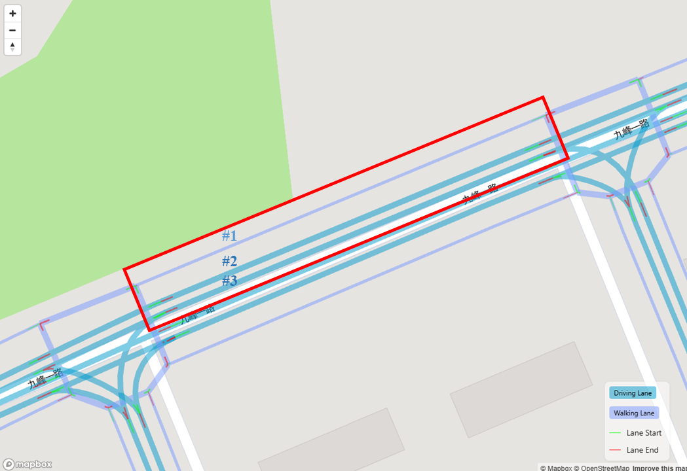
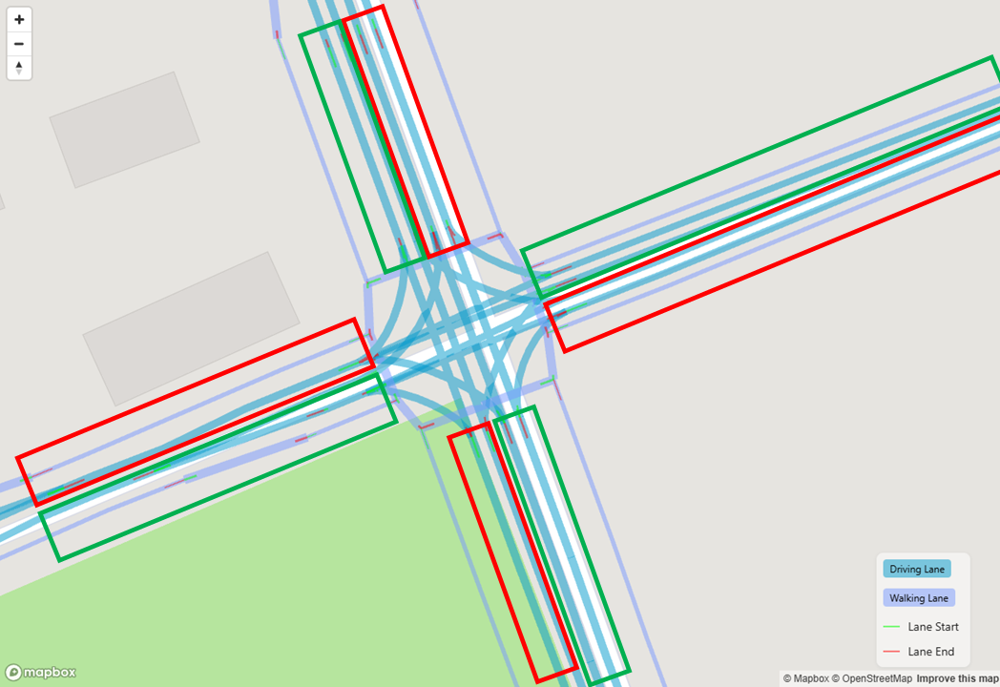
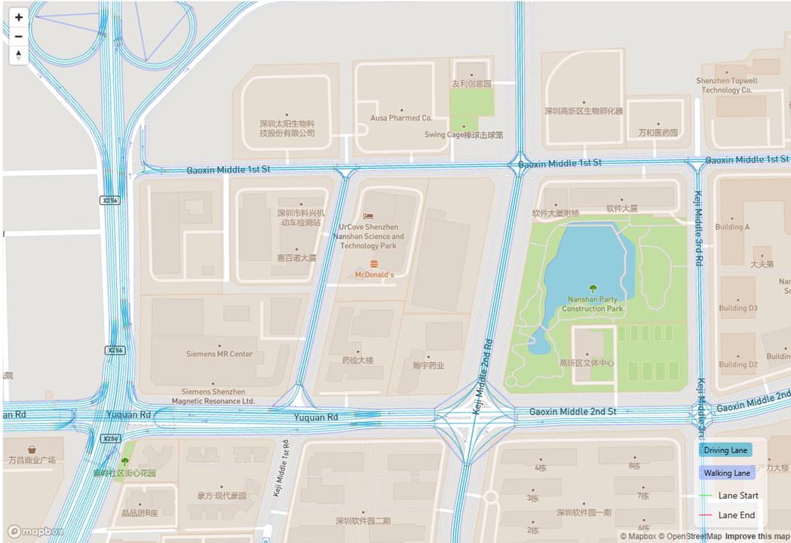

# Core Concepts

## Map

In MOSS, a map serves as the foundational layout that represents the physical infrastructure of the road network and surrounding buildings. A map provides a spatial context within which vehicles can be simulated moving according to predefined rules and behaviors. 

### Road Network

Road network within a map is a key element that defines the structure and connectivity of the streets and highways within the modeled area. The road network includes `lane`, `road` and `junction`.

#### `lane`

Lane is the basic unit of road net geometric elements. There are three types of lanes, driving lanes, walking lanes and rail transit lanes. Lane is a section of a road or junction.

#### `road`

Road is a traveled way on which people or wheeled vehicles move. In MOSS, road is composed of lanes, and one road can have multiple type of lanes.
In the figure below, the road enclosed by the red rectangle consists of three lanes: #1 lane is a walking lane, #2 and #3 lanes are driving lanes.

 

#### `junction`

An area where two or more roads come together. One road can not directly connect to other lane, roads must be connected by lanes within junctions. 
In the figure below, the junction has four driving-in road (enclosed by the green rectangle) and four driving-out road (enclosed by the red rectangle).

 

### Buildings

Buildings within a map describe non-road-network elements surrounding the road network, such as residential buildings in neighborhoods, shopping centers, etc. Buildings are categorized into AOI (Area of Interest) and POI (Point of Interest) based on whether they have an area or not.

#### `AOI` (Area of Interest)

AOIs are the buildings on the roadside which have a specific connection relationship with lane. People/vehicles can travel back and forth between AOI and the road network, as the light brown polygons in the figure below.

#### `POI` (Point of Interest)

POI is specific locations that have some significance, it could be a landmark, business, or any other place that might be of interest to users. All POIs are contained in AOIs.

## Trip

Trips are the demand of mobility simulation.
Trips describe the movement of people or vehicles from one location to another.
The basic unit of trips is (who, when, where, how).

- "Who" means the person or vehicle marked by ID.
- "When" means the departure time of the trip.
- "Where" means the destination of the trip.
- "How" means the mode of the trip, including driving and walking now.
